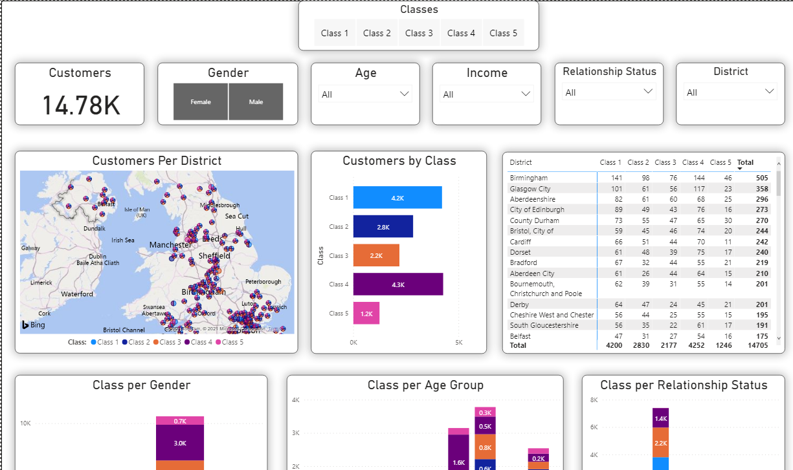
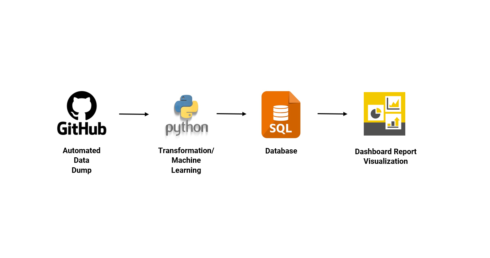

# Customers Classification Visualization

### Classified Dashboard Repoort
**[Link](https://dataanalyst.afolabi.tk/computer-hardware-manufacturer/#dashboard)**

#### Purpose
+ To create an insights dashboard for customers classified based on Machine Learning.
+ To unlock sales insights that are not visible before the sales team for decision support and automate them to reduced manual time  spent in data gathering.

#### Requirements
+ GitHub
+ Python
+ SQL Server
+ Power BI

#### Run locally on command prompt
+ Run this command `git clone https://github.com/itsafo/Customers-Classification-Visualization
.git`
+ Unzip and access the Customers-Classification-Visualization
 folder

#### Screenshot

#### Ref
<a href="https://dataanalyst.afolabi.tk/computer-hardware-manufacturer/#dashboard" target="_blank">Dashboard link</a>

